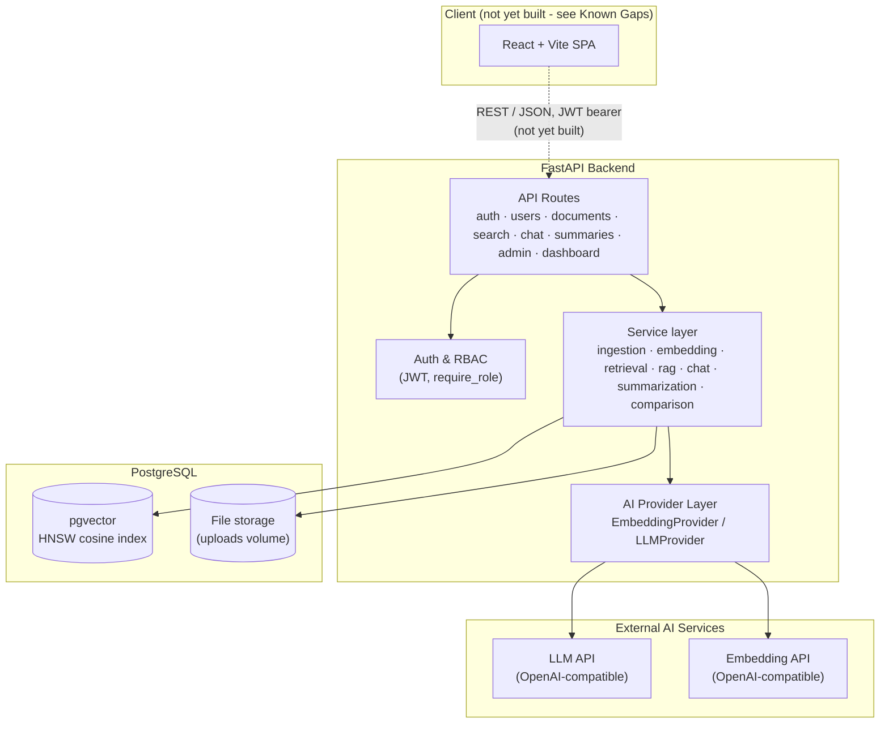
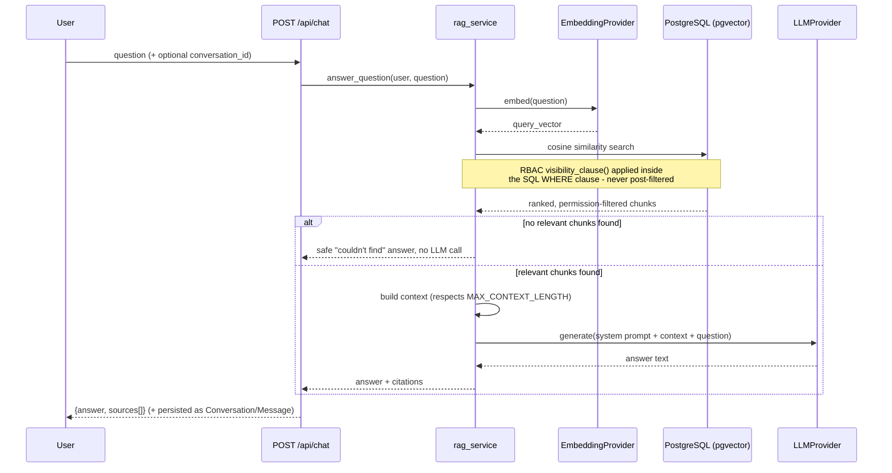
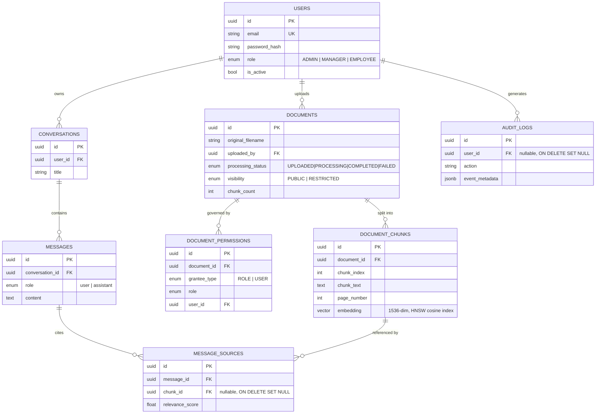

# EnterpriseIQ

AI-powered enterprise knowledge management system using Retrieval-Augmented
Generation (RAG) to answer questions from an organization's own documents,
with role-based access control enforced end-to-end - from the database
query up, not just hidden in the UI.

> **Status:** Backend complete through Phase 10 (testing, security, Docker
> review, and this documentation). **The frontend is not built** beyond the
> Vite/React placeholder scaffold from Phase 1 - every feature below is
> implemented and tested at the API level, but there are no React pages for
> login, the dashboard, document management, chat, etc. yet. This was a
> deliberate, explicitly-flagged staging decision throughout Phases 2-9 (see
> "Known Gaps" below) - the plan is to build the frontend next.

## Features

- **Authentication & RBAC** - JWT-based auth, three roles (ADMIN, MANAGER,
  EMPLOYEE), enforced server-side and at the database-query level, never
  just hidden in a UI.
- **Document management** - upload (PDF/DOCX/TXT/MD), real text extraction
  and chunking, per-document visibility (PUBLIC/RESTRICTED) plus granular
  role- or user-based access grants.
- **Semantic search** - real pgvector cosine-similarity search over
  document chunks, RBAC-filtered inside the SQL query itself.
- **RAG question answering with citations** - retrieval-grounded answers
  that refuse to guess when no relevant context exists, with citations
  tracing every answer back to a specific document, page, and excerpt.
- **Chat with persistent conversation history** - multi-turn conversations,
  private per user (even from admins).
- **Document summarization** - short/detailed/executive summaries, with
  automatic map-reduce for documents too long for a single LLM call.
- **Document comparison** - structured, categorized diffs between two
  documents (policy changes, dates, benefits, etc.), not freeform prose.
- **Role-aware dashboard and admin panel** - personal statistics scoped by
  RBAC for every user, org-wide statistics and audit log access for admins.
- **Provider-agnostic AI layer** - swap embedding/LLM providers via one
  environment variable; includes a deterministic offline `mock` mode so the
  entire application (including real pgvector search) runs without any
  API key at all.

## Architecture



### RAG pipeline (question answering)



### Database schema



## Tech Stack

- **Frontend (scaffold only - see Known Gaps):** React, Vite, TypeScript, TailwindCSS, React Router, Axios, TanStack Query
- **Backend:** Python 3.12, FastAPI, SQLAlchemy 2.x (async), Alembic, Pydantic v2
- **Database:** PostgreSQL + pgvector (HNSW cosine index)
- **AI:** Provider-agnostic LLM/embedding layer (OpenAI-compatible by default; deterministic offline `mock` mode for development/CI)
- **Security:** bcrypt password hashing, JWT auth, RBAC, rate limiting (slowapi), audit logging
- **Infra:** Docker Compose

## Quick Start

```bash
# 1. Configure environment
cp backend/.env.example backend/.env
cp frontend/.env.example frontend/.env

# 2. Start everything
docker compose up --build

# 3. Apply migrations (first run only)
docker compose exec backend alembic upgrade head

# 4. Optional: seed demo accounts (see "Seed data" below)
docker compose exec backend python -m app.db.seed
```

- Backend health check: http://localhost:8000/health
- Backend interactive API docs: http://localhost:8000/docs
- Frontend: http://localhost:5173 (placeholder screen only - see Known Gaps)

**Running without any AI API key:** set `EMBEDDING_PROVIDER=mock` and
`LLM_PROVIDER=mock` in `backend/.env` before starting. Every feature -
upload, real pgvector search, RAG chat, summarization, comparison - works
end-to-end with deterministic, offline providers. This is what the
automated test suite uses (see `backend/tests/conftest.py`). Leaving both
at their default (`openai`) without an API key means uploads succeed but
documents end up in `FAILED` status once the embedding step runs.

> **Note on Docker verification:** this Compose setup and both Dockerfiles
> have been carefully reviewed - a full dependency install (`pip install -r
> requirements.txt`) was verified conflict-free in an isolated environment,
> and `docker-compose.yml` was validated for syntactic/structural
> correctness - but a live `docker compose up --build` has **not** been
> executed against these exact files, since the environment used to build
> this project has no Docker daemon available. Please run it yourself as
> the final check; open an issue if anything doesn't come up cleanly.

## Running the backend without Docker

```bash
cd backend
python -m venv .venv && source .venv/bin/activate
pip install -r requirements.txt
cp .env.example .env  # then point DATABASE_URL at a local Postgres+pgvector instance
alembic upgrade head
uvicorn app.main:app --reload
```

## Running the frontend without Docker

```bash
cd frontend
npm install
cp .env.example .env
npm run dev
```

## Database Schema & Migrations

Eight tables, matching the ER design: `users`, `documents`, `document_chunks`
(with a pgvector `vector(1536)` column and an HNSW cosine-similarity index),
`document_permissions`, `conversations`, `messages`, `message_sources`,
`audit_logs`. All primary keys are UUIDs; foreign keys use `CASCADE` where a
child row has no meaning without its parent (e.g. chunks without their
document) and `SET NULL` where the record should outlive its owner (e.g. a
document should survive the uploader's account being deleted; an audit log
should survive the actor's account being deleted).

Run migrations after the `postgres` container is up:

```bash
docker compose up -d postgres
cd backend
alembic upgrade head          # apply migrations
alembic downgrade base        # or roll everything back
```

Or, once the whole stack is running via `docker compose up --build`, run it
inside the backend container:

```bash
docker compose exec backend alembic upgrade head
```

To add new models later: add the SQLAlchemy model, import it in
`app/models/__init__.py`, then run:

```bash
alembic revision --autogenerate -m "describe the change"
```

**Note:** `alembic revision --autogenerate` cannot generate the pgvector
`hnsw` index or the `CREATE EXTENSION vector` statement (they use raw SQL
inside the migration, since pgvector's index types aren't representable as
plain SQLAlchemy `Index` objects) - as a result, `alembic check` will always
report that index as spurious "drift." That's expected; don't let
autogenerate remove it.

## Authentication & RBAC

**Login flow:** `POST /api/auth/register` (public, always creates an
`EMPLOYEE`) or an admin creates an account via `POST /api/users` with any
role. `POST /api/auth/login` exchanges email+password for a JWT access
token. Every protected endpoint expects `Authorization: Bearer <token>`.

**Key design decision - tokens carry no role claim.** The JWT payload is
just `{"sub": "<user id>", "iat": ..., "exp": ...}`. `get_current_user`
re-loads the user (and their current role and `is_active` flag) from the
database on *every* request rather than trusting a claim baked into the
token at login time. This costs one extra query per request but means a
role change or account deactivation takes effect immediately, on the very
next request - not just after the old token happens to expire. This is
covered by `test_deactivated_user_token_rejected_on_next_request`.

**RBAC:** `require_role(*roles)` is a dependency factory built on top of
`get_current_user`; every `/api/users` route uses
`require_role(UserRole.ADMIN)`. There's no separate "is this allowed"
logic anywhere else - routes, and only routes, declare which roles they
need, and the check always happens server-side regardless of what the
frontend shows or hides.

**Admin safety guardrails** (enforced in `user_service`, not just routes):
an admin can never delete their own account, and the last remaining active
ADMIN can never be demoted, deactivated, or deleted by anyone (including
themselves) - otherwise the system would have no admin left to fix things.

**Consistent errors:** every error response - ours or FastAPI's own - has
the shape `{"error": {"code": "...", "message": "..."}}` (see
`app/utils/errors.py` and the exception handlers in `app/main.py`).

**Password hashing:** uses the `bcrypt` library directly rather than
`passlib` - `passlib` 1.7.4 (its latest release) is incompatible with
`bcrypt>=4.1` (confirmed while building this project: it crashes reading
`bcrypt.__about__`, which was removed upstream, and mishandles bcrypt's
72-byte input limit).

### Seed data

```bash
docker compose exec backend python -m app.db.seed
# or locally: cd backend && python -m app.db.seed
```

Creates these accounts if they don't already exist (idempotent - safe to
re-run):

| Role | Email | Password |
|---|---|---|
| ADMIN | `admin@enterpriseiq.example` | `Admin123!` |
| MANAGER | `manager@enterpriseiq.example` | `Manager123!` |
| EMPLOYEE | `employee@enterpriseiq.example` | `Employee123!` |

**These are local-development defaults only and must never be used as-is
anywhere shared or production.**

## Document Upload & Processing

**Pipeline:** `POST /api/documents` (multipart upload, ADMIN/MANAGER only)
validates the file (extension, size, and a magic-byte/structure check that
the content actually matches its claimed type - a renamed `.exe` or a
truncated PDF is rejected before it ever reaches extraction), saves it to
`UPLOAD_DIR` under a generated filename, creates the `Document` row
(`UPLOADED`), and schedules a FastAPI background task that extracts text
(PyMuPDF for PDF, `python-docx` for DOCX, plain read for TXT/MD),
splits it into overlapping chunks (`CHUNK_SIZE`/`CHUNK_OVERLAP`, cut on
whitespace where possible), and stores them as `DocumentChunk` rows -
transitioning the document through `PROCESSING` to `COMPLETED`, or to
`FAILED` with `processing_error` set if anything goes wrong (including a
document with no extractable text, e.g. a scanned/image-only PDF - OCR is
out of scope for now).

**Key design note - embeddings are generated as part of this same
pipeline.** After chunks are stored, the background task calls the
configured `EmbeddingProvider` (see "Embedding Generation & Search" below)
to fill in each chunk's `embedding` column before marking the document
`COMPLETED` - so `COMPLETED` now means "extracted, chunked, *and*
embedded," i.e. actually ready for semantic search.

**RBAC on documents:**
- **View/list/download** - open to any authenticated role; a `RESTRICTED`
  document is only visible to its uploader, an ADMIN, or someone with an
  explicit grant (role- or user-based) via `POST /api/documents/{id}/permissions`
  (ADMIN-only). A restricted document a user can't see and one that
  doesn't exist both return the same 404 - deliberately, so its existence
  is never leaked.
- **Upload** - ADMIN or MANAGER only (employees can't upload, per the
  brief's RBAC design).
- **Delete / change visibility** - ADMIN (any document) or the MANAGER who
  uploaded it (their own documents only).
- **Grant/list/revoke permissions** - ADMIN only.

**Known limitations** (documented rather than silently accepted): no OCR
for scanned/image PDFs; no table extraction from DOCX; a background task
that fails to even reach its own exception handler (e.g. the whole worker
process crashing) can leave a document stuck in `PROCESSING` - a real task
queue (Celery/RQ, see section 24 of the brief) would add retries and a
dead-letter mechanism for this, which is intentionally deferred past this
lightweight FastAPI-background-task version.

## Embedding Generation & Search

**Provider abstraction (project brief section 33):** `app/ai/embedding_provider.py`
defines the `EmbeddingProvider` interface; `app/ai/factory.py` is the only
place that reads `EMBEDDING_PROVIDER` and picks a concrete implementation.
Nothing else in the codebase depends on a specific provider.

- **`openai`** (default, production): `OpenAICompatibleEmbeddingProvider`
  makes raw HTTP calls to `POST {EMBEDDING_BASE_URL}/embeddings` - not a
  vendor SDK - so anything speaking the same wire format (OpenAI itself,
  Azure OpenAI-compatible proxies, a self-hosted vLLM/Ollama server) works
  by changing `EMBEDDING_BASE_URL`, with retries (via `tenacity`) on
  transient network failures.
- **`mock`** (local dev/CI/demos only): `MockEmbeddingProvider` hashes each
  text into a deterministic, unit-normalized vector - same text always
  produces the same vector, different texts produce different ones - with
  zero semantic understanding and no network call at all. This lets the
  *entire* application run end-to-end, including real pgvector similarity
  search, without any API key - useful for anyone running this project
  without wanting to supply real credentials just to see it work. **Never
  use this in production** - set `EMBEDDING_PROVIDER=openai` with a real
  `EMBEDDING_API_KEY` for actual semantic search quality. The test suite
  uses `mock` by default (see `backend/tests/conftest.py`).

**Pipeline integration:** the ingestion background task (Phase 4) now calls
`embedding_service.generate_embeddings()` after chunk storage and before
marking a document `COMPLETED`, batching requests (100 chunks per API call)
so a large document doesn't send one enormous request.

**Search (`POST /api/search`, project brief section 10):** embeds the query
with the same configured provider, then runs a single SQL query
(`document_chunk_repository.search_similar`) that:
1. Computes cosine distance via pgvector's `<=>` operator against the HNSW
   index built in Phase 2.
2. Applies the *exact same* RBAC visibility rule as document listing
   (`document_repository.visibility_clause`) - an unauthorized chunk is
   never fetched, ranked, or returned, not filtered out afterward.
3. Restricts to `COMPLETED` documents with a non-null embedding, and
   applies the similarity threshold, in the same `WHERE` clause.
4. Orders by distance and limits to `top_k`.

Supports optional filters: `file_type`, `uploaded_by`, `created_after`/
`created_before`. (Section 10 also mentions filtering by "department" and
"tags" - the current schema has no such fields; adding them would mean a
new migration, which is out of scope for this phase and is noted as a
future improvement rather than silently ignored.)

## RAG Question Answering & Citations

**`POST /api/chat`** (project brief section 8) implements the full pipeline:
question validation -> query embedding -> pgvector search -> RBAC filtering
(all reused unchanged from Phase 5's `retrieval_service.search`) -> context
construction -> LLM generation -> answer + citations.

**Key design decision - the LLM is never called when there's no relevant
context.** If retrieval finds nothing above the similarity threshold (or
the question resolves to an inaccessible/nonexistent document via RBAC),
`rag_service` returns a fixed, safe response - *"I couldn't find relevant
information in the available documents..."* - with an empty `sources` list,
without invoking the LLM at all. This is a stronger anti-hallucination
guarantee than instructing the model not to guess (brief section 8): an
absent context block removes the *opportunity* to answer from general
knowledge, rather than just asking the model nicely not to. This is
verified directly in `tests/test_rag_service.py` by asserting the mock
LLM's call count is zero in this path.

**LLMProvider abstraction** (`app/ai/llm_provider.py`), mirroring
`EmbeddingProvider` exactly: `OpenAICompatibleLLMProvider` makes raw HTTP
calls to `POST {LLM_BASE_URL}/chat/completions` (temperature `0.2` - this
is factual RAG answering, not creative writing), and `LLM_PROVIDER=mock`
gives a deterministic, offline provider for the same reasons as its
embedding counterpart. The system prompt instructs the model to answer only
from the provided context, say so explicitly when the context is
insufficient, never invent facts, and distinguish between multiple source
documents by name.

**Context construction** (`rag_service._build_context`) greedily includes
ranked search results, labeled `[Source N: {document}, page {p}, section
'{s}']`, up to `MAX_CONTEXT_LENGTH` characters - always including at least
the single most relevant result even if it alone exceeds the budget, since
some context beats none. The citations returned to the client are exactly
the sources that made it into the prompt, not every result retrieval found.

**Citation shape** matches project brief section 9's example
(`document_id`, `document_name`, `chunk_id`, `page`, `relevance_score`),
enriched with `excerpt` and `section_title` - a citation naming only a
document and page number, without showing what it actually says, isn't
very useful for deciding whether to trust an answer.

**Staged deliberately:** Phase 6 itself was single-turn - no conversation
was persisted. Phase 7 (below) extends this same `/api/chat` endpoint with
`Conversation`/`Message`/`MessageSource` persistence, so the RAG pipeline
itself could be built and verified in isolation first.

## Chat & Conversation History

`chat_service` wraps the Phase 6 `rag_service` (still a pure, stateless
function, unchanged) with persistence: one call to `POST /api/chat` creates
or continues a `Conversation`, records the user's question and the
assistant's answer as `Message` rows, and records each citation actually
used as a `MessageSource` row.

- **No separate "create conversation" endpoint.** Omitting `conversation_id`
  from the request both creates a new conversation and asks the first
  question in it, returning the new `conversation_id` - a conversation with
  no messages isn't meaningful on its own.
- **Conversations are private to the user who had them - with no admin
  exception.** `GET /api/conversations` and `GET /api/conversations/{id}`
  filter by `user_id` for every role, including ADMIN: a conversation is a
  personal Q&A session, not organizational knowledge like a document.
  Verified directly: `test_admin_cannot_view_another_users_conversation`.
- **Title auto-derived from the first question** (truncated to 60 chars),
  not generated by a second LLM call purely for cosmetics - a nicer
  LLM-generated title is a reasonable future improvement.
- **Historical citations are never re-checked against live document RBAC.**
  Once you asked a question and got an answer, that's your own conversation
  history - not a live view onto documents. If the underlying document is
  later deleted, `MessageSource.chunk_id`'s `ON DELETE SET NULL` (see Phase
  2) means the citation degrades gracefully (the relevance score is kept;
  document/chunk details become `null`) rather than the message
  disappearing - verified directly in
  `test_citation_degrades_gracefully_when_source_document_deleted`, which
  deletes a real document mid-conversation and confirms the message
  survives with a nulled-out citation.
- **`DELETE /api/conversations/{id}`** ("Clear conversation," brief section
  11) - owner only, cascades to messages and sources.

## Summarization & Document Comparison

**`POST /api/documents/{id}/summarize`** (project brief section 12) takes a
`summary_type` (`SHORT`, `DETAILED`, or `EXECUTIVE`) and automatically
picks a strategy based on document length:

- **Direct**: if the document's full extracted text fits within
  `MAX_CONTEXT_LENGTH` (the same budget `rag_service` uses for RAG context -
  reused deliberately rather than adding a second "how much text can we
  hand the LLM at once" setting), one LLM call summarizes it.
- **Map-reduce**: otherwise, chunks are grouped to fit the budget, each
  group is summarized independently (MAP), and those partial summaries are
  combined into one final summary (REDUCE) - one level of map-reduce; an
  extremely large document whose *combined partial summaries* still exceed
  the budget is truncated defensively rather than recursing indefinitely
  (documented limitation, not silently ignored). Verified directly by
  counting actual mock-LLM calls: a short document makes exactly one call,
  a document split into 5 groups makes exactly 6 (5 MAP + 1 REDUCE).

**`POST /api/documents/compare`** (section 13) retrieves both documents'
full text and asks the LLM to return **structured JSON**, not freeform
prose, so a frontend can render categorized results rather than parsing
paragraphs. The six categories from the brief (`Policy Changes`, `Dates`,
`Responsibilities`, `Eligibility`, `Benefits`, `Important Differences`) are
a **fixed, known set** - the response always contains exactly these six,
backfilled empty if the LLM omitted one, rather than letting the LLM invent
arbitrary category names. If the LLM's response isn't valid JSON (real
models don't always comply perfectly, even when instructed), the raw text
degrades gracefully into the `Important Differences` category instead of
failing the request outright - verified with a test that feeds the parser
deliberately non-JSON prose.

For documents too large to compare directly (combined text exceeds the
budget), comparison reuses `summarization_service.summarize_chunks` to
first summarize each side, then compares the *summaries* - comparing two
multi-hundred-page documents verbatim in one LLM call isn't feasible, and a
well-formed summary preserves the important content while fitting the
budget.

**RBAC is entirely reused, not reimplemented**: both endpoints call
`document_service.get_document`, the same visibility-checked lookup used
by document viewing/downloading/search/chat - a document you can't view
can't be summarized or compared either, and returns the same 404 (not 403)
as everywhere else.

## Dashboard & Admin Panel

**`GET /api/dashboard`** (project brief section 14, open to every
authenticated role) is scoped entirely to the requesting user via the same
RBAC primitives used everywhere else - `document_repository.visibility_clause`
for document counts, per-`user_id` filtering for conversations. There's no
role-branching logic in `dashboard_service` at all: the dashboard "changes
based on role" simply because an EMPLOYEE's and a MANAGER's underlying
RBAC-filtered queries naturally return different rows. Returns visible
document counts (with a status breakdown), the caller's own upload count
(0 for employees, who can't upload), their own conversation count, and
recent documents/conversations.

**`GET /api/admin/stats`** (ADMIN only) is the org-wide counterpart -
every query here is unfiltered by visibility or ownership on purpose:
total documents/users (with status/role breakdowns), total conversations,
recent uploads across every user, and recent activity from the audit log.
"Most searched queries" is **exact-string frequency counting** of past
search queries (via the audit log), not semantic topic clustering - two
differently-worded questions about the same policy are counted separately.
True "most searched *topics*" would need embedding-based clustering, which
is out of scope here and noted as a future improvement rather than quietly
approximated as something it isn't.

**`GET /api/admin/audit-logs`** (ADMIN only) exposes the audit trail
that's been building since Phase 3, with filters for `user_id`, `action`,
and a date range.

**A real bug caught before it shipped**: nesting raw ORM objects inside a
manually-constructed Pydantic response (e.g. `DashboardResponse`'s
`recent_conversations` field, built directly from `List[Conversation]`
ORM rows) is a different code path from FastAPI's own `response_model`
auto-serialization, and silently requires `model_config = ConfigDict(from_attributes=True)`
on the *nested* schema too - `ConversationSummaryResponse` and
`AuditLogResponse` didn't have it. Caught with a two-line reproduction
before writing the routes that would have hit it, not discovered via a
failing test afterward.

## Security

Consolidated from what's been built across every phase (project brief
section 22):

| Control | Implementation |
|---|---|
| Password hashing | `bcrypt` directly (not `passlib` - see Authentication & RBAC section for why) |
| Authentication | JWT access tokens; role is never trusted from the token, always re-checked from the DB per request |
| Authorization | `require_role()` at the route layer + data-dependent RBAC (ownership, document visibility) in services, enforced in SQL `WHERE` clauses, not post-filtered in Python |
| File validation | Extension allowlist, size limits (aborted mid-stream, not after writing), magic-byte/structure checks (PDF header, DOCX zip+OOXML marker, UTF-8 for text) |
| Secure filenames | Uploaded files are stored under generated UUID names; the user-supplied filename is never used as a path |
| Input validation | Pydantic schemas on every request body, with custom validators where needed (e.g. rejecting whitespace-only questions) |
| SQL injection | Not applicable by construction - 100% SQLAlchemy ORM/Core parameterized queries, no raw string interpolation into SQL anywhere |
| CORS | Configured via `CORS_ORIGINS`, restricted to the frontend's origin by default (never `*`) |
| Rate limiting | `slowapi`: 200/min global default, 10/min on login, 5/min on register - the two routes brute-force/spam attacks actually target |
| Secrets | No secrets in source control (`.env` is gitignored); **the app refuses to boot** if `JWT_SECRET_KEY` is missing, placeholder-shaped, or under 32 characters outside `APP_ENV=development` |
| Audit logging | Every sensitive action (login, upload, delete, role change, permission grant, search, chat, comparison) recorded with actor, action, resource, and metadata; queryable by admins via `/api/admin/audit-logs` |
| Consistent errors | Every error response - ours, Pydantic's, a rate-limit rejection, or a genuine unhandled bug - comes back as `{"error": {"code": ..., "message": ...}}`; unhandled exceptions are logged with full tracebacks server-side but never leak internals to the client unless `DEBUG=true` |

## API Reference

Full interactive documentation (request/response schemas, try-it-out) is
auto-generated by FastAPI at `/docs` once the backend is running. Summary:

| Method & Path | Auth | Description |
|---|---|---|
| `POST /api/auth/register` | Public | Self-registration (always creates an EMPLOYEE) |
| `POST /api/auth/login` | Public | Returns a JWT access token |
| `GET /api/auth/me` | Any | Current user's profile |
| `GET /api/users` | ADMIN | List users |
| `POST /api/users` | ADMIN | Create a user with any role |
| `GET /api/users/{id}` | ADMIN | Get a user |
| `PATCH /api/users/{id}` | ADMIN | Update role/active status/name |
| `DELETE /api/users/{id}` | ADMIN | Delete a user |
| `POST /api/documents` | ADMIN, MANAGER | Upload a document |
| `GET /api/documents` | Any | List documents visible to you |
| `GET /api/documents/{id}` | Any (RBAC-checked) | Get document metadata |
| `GET /api/documents/{id}/download` | Any (RBAC-checked) | Download the original file |
| `PATCH /api/documents/{id}` | ADMIN, owning MANAGER | Change visibility |
| `DELETE /api/documents/{id}` | ADMIN, owning MANAGER | Delete a document |
| `POST /api/documents/{id}/permissions` | ADMIN | Grant access to a restricted document |
| `GET /api/documents/{id}/permissions` | ADMIN | List access grants |
| `DELETE /api/documents/{id}/permissions/{id}` | ADMIN | Revoke an access grant |
| `POST /api/search` | Any | Semantic (pgvector) search, RBAC-filtered |
| `POST /api/chat` | Any | Ask a question (RAG); creates/continues a conversation |
| `GET /api/conversations` | Any (own only) | List your conversations |
| `GET /api/conversations/{id}` | Any (own only) | Full message history + citations |
| `DELETE /api/conversations/{id}` | Any (own only) | Delete a conversation |
| `POST /api/documents/{id}/summarize` | Any (RBAC-checked) | Short/detailed/executive summary |
| `POST /api/documents/compare` | Any (RBAC-checked on both) | Structured comparison of two documents |
| `GET /api/dashboard` | Any | Personal, RBAC-scoped statistics |
| `GET /api/admin/stats` | ADMIN | Org-wide statistics |
| `GET /api/admin/audit-logs` | ADMIN | Filterable audit trail |

## Example API Requests

```bash
BASE=http://localhost:8000

# Register
curl -s -X POST $BASE/api/auth/register \
  -H "Content-Type: application/json" \
  -d '{"name": "Jane Doe", "email": "jane@example.com", "password": "StrongPassw0rd!"}'

# Login (save the access_token from the response)
TOKEN=$(curl -s -X POST $BASE/api/auth/login \
  -H "Content-Type: application/json" \
  -d '{"email": "jane@example.com", "password": "StrongPassw0rd!"}' | python3 -c "import sys,json; print(json.load(sys.stdin)['access_token'])")

# Upload a document (requires ADMIN or MANAGER - use a seeded account, see below)
curl -s -X POST $BASE/api/documents \
  -H "Authorization: Bearer $TOKEN" \
  -F "file=@handbook.pdf" \
  -F "visibility=PUBLIC"

# Semantic search
curl -s -X POST $BASE/api/search \
  -H "Authorization: Bearer $TOKEN" -H "Content-Type: application/json" \
  -d '{"query": "What is the remote work policy?"}'

# Ask a question (RAG)
curl -s -X POST $BASE/api/chat \
  -H "Authorization: Bearer $TOKEN" -H "Content-Type: application/json" \
  -d '{"question": "How many days of annual leave do employees get?"}'

# Summarize a document
curl -s -X POST $BASE/api/documents/<document_id>/summarize \
  -H "Authorization: Bearer $TOKEN" -H "Content-Type: application/json" \
  -d '{"summary_type": "EXECUTIVE"}'

# Compare two documents
curl -s -X POST $BASE/api/documents/compare \
  -H "Authorization: Bearer $TOKEN" -H "Content-Type: application/json" \
  -d '{"document_id_a": "<id_a>", "document_id_b": "<id_b>"}'

# Personal dashboard
curl -s $BASE/api/dashboard -H "Authorization: Bearer $TOKEN"
```

## Troubleshooting

| Symptom | Likely cause / fix |
|---|---|
| `docker compose up` fails immediately on the `backend` service | You likely haven't created `backend/.env` yet - run `cp backend/.env.example backend/.env` first (see Quick Start). |
| App refuses to start: `JWT_SECRET_KEY is missing, looks like a placeholder...` | You're running with `APP_ENV` other than `development` and still have the `.env.example` placeholder secret. Set a real random value (e.g. `openssl rand -hex 32`). |
| Uploaded documents stay stuck in `FAILED` with a message about `EMBEDDING_API_KEY` | You're using `EMBEDDING_PROVIDER=openai` (the default) without a real API key. Either set a real key, or set `EMBEDDING_PROVIDER=mock` (and `LLM_PROVIDER=mock`) for a no-API-key demo - see Quick Start. |
| `alembic upgrade head` fails with a connection error | Postgres isn't ready yet, or `DATABASE_URL` doesn't match `docker-compose.yml`'s `postgres` service. Run `docker compose ps` to check the container is healthy first. |
| `CREATE EXTENSION vector` / pgvector errors | Make sure you're using the `pgvector/pgvector:pg16` image specified in `docker-compose.yml`, not a plain `postgres` image - it doesn't have the extension installed. |
| `pip install` fails on `bcrypt` or `asyncpg` locally (non-Docker) | Install build tools for your OS (`build-essential`/Xcode CLI tools) - these normally ship as prebuilt wheels, so this usually only happens on an unsupported platform/architecture. |
| Getting `429 RATE_LIMIT_EXCEEDED` while testing manually | Expected on `/api/auth/login` (10/min) and `/api/auth/register` (5/min) if you're scripting rapid requests. Wait a minute, or set `RATE_LIMIT_ENABLED=false` for local debugging only. |
| CORS errors in a browser console | Add your frontend's actual origin to `CORS_ORIGINS` in `backend/.env` (JSON array syntax, e.g. `["http://localhost:5173"]`). |
| Tests fail with `attached to a different loop` | A known asyncpg + pytest-asyncio interaction when reusing pooled connections across per-test event loops - see the extensive comments in `tests/conftest.py` and `tests/test_ingestion.py`. Re-running usually isn't the fix; it means a test is missing the engine-disposal fixture pattern used elsewhere in the suite. |

## Running tests

```bash
cd backend
pip install -r requirements.txt
docker compose up -d postgres   # tests run against a real Postgres+pgvector DB
alembic upgrade head
pytest -v
```

`tests/conftest.py` sets sensible defaults (`EMBEDDING_PROVIDER=mock`,
`LLM_PROVIDER=mock`, `RATE_LIMIT_ENABLED=false`, a local `DATABASE_URL`) so
`pytest` works out of the box with no manual environment setup - real
environment variables, if set, always take precedence.

**149 tests**, all running against a real database (no mocked DB layer) -
including the specific test the brief calls out as most important: proving
a user cannot retrieve information from a document they don't have
permission to access, verified at three separate layers (document
retrieval, semantic search, and RAG chat) plus once more for conversation
privacy between users.

To measure coverage:

```bash
pip install pytest-cov
pytest --cov=app --cov-report=term-missing
```

**Coverage caveat:** SQLAlchemy's async support uses `greenlet` to bridge
async and sync execution internally, which is known to interact poorly
with `coverage.py`'s tracer - lines inside heavily-async service functions
can show as "missing" in the report even when a passing test exercises
them (confirmed by deliberately isolating `test_ingestion.py`, which
demonstrably calls `document_service.upload_document` successfully, yet
its audit-log line still reports as uncovered). Don't take the coverage
percentage as gospel; two real, previously-untested gaps *were* found this
way during Phase 10 (the document download endpoint and the seed script)
and both now have dedicated tests.

**A real bug found only by manually running the actual server**, not by
the automated suite: the seed script originally used `.local` email
addresses (`admin@enterpriseiq.local`). `.local` is a special-use TLD
reserved for mDNS (RFC 6762), and `email-validator` (backing Pydantic's
`EmailStr` on the real `LoginRequest`/`RegisterRequest` schemas) correctly
rejects it - meaning **the seeded demo accounts could not actually log in
through the real HTTP API**. Every automated test in the suite creates
users directly via `user_repository.create(...)` with `@example.com`
addresses, which bypasses `EmailStr` validation entirely, so nothing
caught this until a genuine end-to-end curl smoke test against a live
`uvicorn` process did. Fixed by switching to `.example` (RFC 2606's
reserved documentation TLD, which validators do accept), and added
`test_seeded_accounts_can_actually_log_in_via_http` specifically to close
this class of gap going forward - it's the one seed test that goes through
the real HTTP endpoint instead of the repository.

## Project Structure

```text
enterpriseiq/
├── backend/
│   ├── app/
│   │   ├── main.py            # FastAPI app, routers, CORS, /health
│   │   ├── config.py          # Settings loaded from environment variables
│   │   ├── db/                # Async engine, session factory, declarative Base
│   │   ├── api/
│   │   │   ├── dependencies.py     # get_db, get_current_user, require_role
│   │   │   └── routes/             # auth, users, documents, search, chat, dashboard, summaries, admin
│   │   ├── models/            # SQLAlchemy ORM models (User, Document, DocumentChunk, ...)
│   │   ├── schemas/            # Pydantic request/response schemas
│   │   ├── services/           # Business logic (auth, user, document, ingestion, embedding, retrieval, rag, chat, summarization, comparison, dashboard, admin)
│   │   ├── repositories/       # DB query layer (user, document, document_permission, document_chunk, conversation, message, audit_log)
│   │   ├── ai/                  # EmbeddingProvider + LLMProvider interfaces; OpenAI-compatible and mock impls
│   │   ├── ingestion/           # extractors.py (PDF/DOCX/TXT/MD), chunker.py, validators.py, storage.py
│   │   ├── security/            # password.py (bcrypt), jwt.py (access tokens), rate_limit.py (slowapi)
│   │   └── utils/               # errors.py, audit_actions.py
│   ├── tests/
│   ├── alembic/
│   ├── requirements.txt
│   ├── Dockerfile
│   └── .env.example
│
├── frontend/                    # placeholder only - see "Known Gaps" below
│   ├── src/
│   │   ├── pages/              # Route-level components (not yet implemented)
│   │   ├── components/         # Reusable UI components (not yet implemented)
│   │   ├── layouts/, hooks/, services/, api/, types/, context/, utils/
│   ├── package.json
│   ├── vite.config.ts
│   ├── tailwind.config.js
│   └── Dockerfile
│
├── sample_documents/
├── docker-compose.yml
├── .gitignore
└── README.md
```

## Roadmap

1. ✅ Project scaffolding
2. ✅ Database models & Alembic migrations
3. ✅ Authentication & RBAC
4. ✅ Document upload & processing pipeline
5. ✅ Embedding generation & pgvector search
6. ✅ RAG question answering & citations
7. ✅ Chat & conversation history
8. ✅ Summarization & document comparison
9. ✅ Dashboard & admin panel
10. ✅ Testing, security hardening, Docker review, full documentation

**Backend feature work is done.** The frontend (React pages for every
screen above) is the next planned phase of work - see "Known Gaps."

## Known Gaps

Called out explicitly rather than left for someone to discover:

- **No frontend UI beyond the Phase 1 placeholder scaffold.** Every backend
  feature is implemented, tested, and documented above, but there are no
  React pages/components for login, the dashboard, document management,
  chat, admin, etc. This was flagged at the end of Phases 6, 7, 8, and 9
  and is the planned next body of work.
- **No live Docker execution in this environment.** `docker-compose.yml`
  and both Dockerfiles were carefully reviewed (dependency install
  verified conflict-free, YAML validated, environment variables
  cross-checked) but not run against a live Docker daemon - see the note
  under Quick Start.
- **"Most searched queries"** (`/api/admin/stats`) is exact-string
  frequency counting, not semantic topic clustering - two different
  phrasings of the same question are counted separately.
- **No OCR** for scanned/image-only PDFs - these fail ingestion with a
  clear error rather than silently producing an empty document.
- **No table extraction from DOCX** - only paragraph text and headings.
- **Map-reduce summarization is single-level.** An extremely large
  document whose combined partial summaries still exceed
  `MAX_CONTEXT_LENGTH` is truncated defensively rather than recursing into
  a second reduce pass.
- **No department/tags filtering on search**, since the current schema has
  no such fields - would require a new migration.
- **No refresh tokens.** Access tokens are short-lived and stateless;
  logout is client-side token discard. A role change or deactivation still
  takes effect immediately (the token carries no role claim - see
  Authentication & RBAC), but there's no server-side way to revoke a
  specific still-valid token before it expires.
- **Background processing has no retry/dead-letter mechanism.** A FastAPI
  `BackgroundTask` that crashes before reaching its own exception handler
  (e.g. the whole worker process dying) can leave a document stuck in
  `PROCESSING`. A real task queue (Celery/RQ) would add this.
- **Single-tenant.** No organization/workspace isolation - all users share
  one document space, partitioned only by the RBAC rules described above.
- **Conversation titles are truncation-based, not LLM-generated** -
  deliberately, to avoid a second API call purely for cosmetics.

